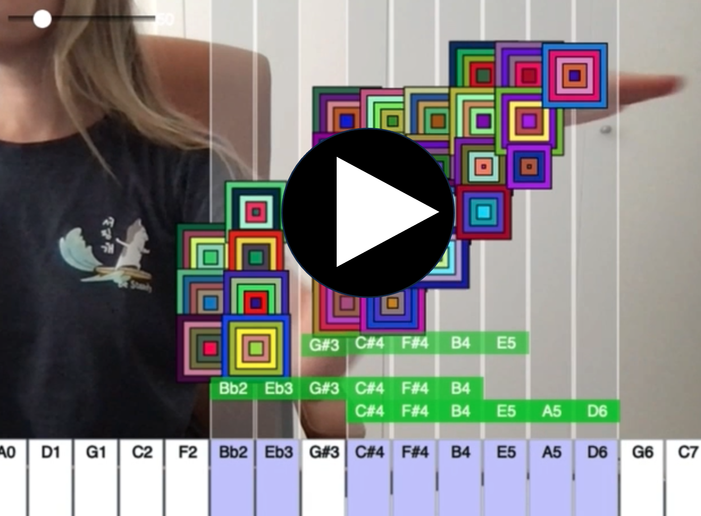

# PROJECT: WEBCAM PIANO

## TABLE OF CONTENTS
1. [HOW TO USE](#HOWTOUSE)
2. [DEMO](#DEMO)

### HOW TO USE 
1. **Open the Project**:
   - Open Visual Studio Code.
   - Navigate to your project directory (`webcam_piano`).

2. **Open the HTML File**:
   - Open `index.html` in Visual Studio Code.

3. **Start the Live Server**:
   - If you haven't installed the Live Server extension, install it from the Extensions panel by searching for "Live Server".
   - Right-click on `index.html` and select "Open with Live Server".

4. **Grant Camera Permission**:
   - When prompted by your web browser, grant permission to use the video camera. This is necessary for the Webcam Piano project to function correctly.

5. **View the Project**:
   - Your default web browser will open, displaying the project. You can interact with the project through the browser.

### DEMO 
**Webcam Piano** 

*Author: [https://github.com/randomoi](https://github.com/randomoi)*
